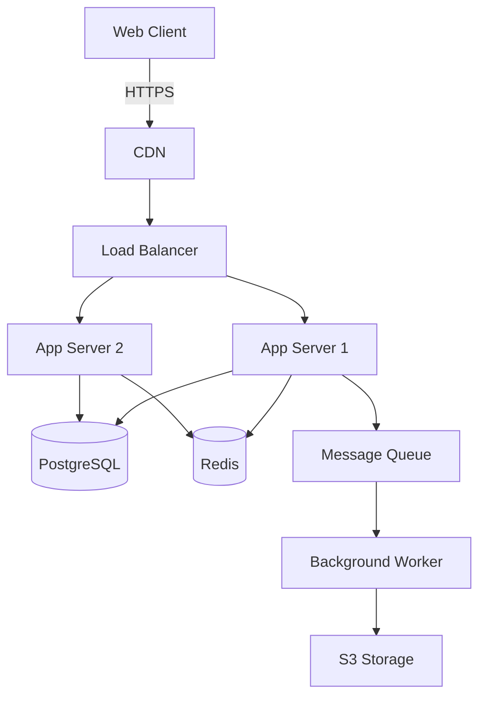
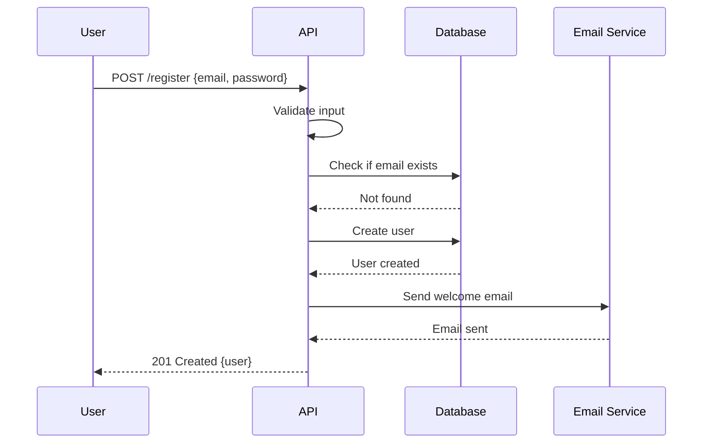
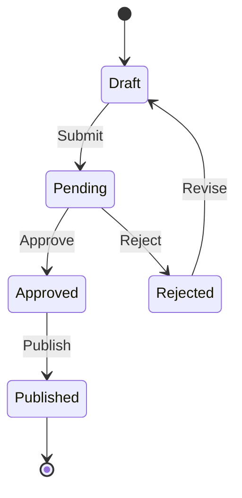

# Docs Master

## What I Do

I help create documentation that is clear, useful, and maintainable. I ensure documentation serves its audience — whether onboarding new developers, explaining architecture, or documenting APIs.

## README

### Structure
```markdown
# Project Name

One-line description of what this project does and why it exists.

## Table of Contents
- [Prerequisites](#prerequisites)
- [Quick Start](#quick-start)
- [Development](#development)
- [Architecture](#architecture)
- [Configuration](#configuration)
- [Testing](#testing)
- [Deployment](#deployment)
- [Contributing](#contributing)
- [License](#license)

## Prerequisites

- Node.js 20+
- PostgreSQL 16+
- Redis 7+
- Docker & Docker Compose (optional)

## Quick Start

```bash
# 1. Clone and install
git clone https://github.com/org/project.git
cd project
npm install

# 2. Set up environment
cp .env.example .env
# Edit .env with your values

# 3. Start services
docker compose up -d db redis
npm run db:migrate
npm run dev

# 4. Open http://localhost:3000
```

## Development

### Project Structure
```
src/
├── api/          # API routes and controllers
├── services/     # Business logic
├── repositories/ # Data access
├── models/       # Data models and schemas
├── middleware/   # Express middleware
├── utils/        # Shared utilities
└── config/       # Configuration
```

### Available Scripts
```bash
npm run dev       # Start development server with hot reload
npm run build     # Build for production
npm run start     # Start production server
npm run lint      # Run ESLint
npm run typecheck # Run TypeScript type checking
npm test          # Run all tests
npm test:watch    # Run tests in watch mode
npm run db:migrate # Run database migrations
npm run db:seed    # Seed database with test data
```

### Code Style
- ESLint + Prettier configured
- Conventional commits for commit messages
- PR template in `.github/PULL_REQUEST_TEMPLATE.md`

## Architecture

[Link to architecture docs or ADRs]

## Configuration

All configuration via environment variables. See `.env.example` for required variables.

| Variable         | Description          | Default           | Required |
|------------------|----------------------|-------------------|----------|
| `DATABASE_URL`   | PostgreSQL connection| `postgresql://...`| Yes      |
| `REDIS_URL`      | Redis connection     | `redis://localhost:6379` | No |
| `PORT`           | Server port          | `3000`            | No       |
| `NODE_ENV`       | Environment          | `development`     | No       |

## Testing

```bash
# Run all tests
npm test

# Run with coverage
npm test -- --coverage

# Run specific test file
npm test -- user.test.ts

# Run E2E tests
npm run test:e2e
```

## Deployment

[Link to deployment docs]

## Contributing

See [CONTRIBUTING.md](CONTRIBUTING.md)

## License

MIT
```

### README Best Practices
- Start with the problem it solves, not the technology
- Include a working example within 5 minutes
- Use badges for build status, coverage, version
- Keep it current — outdated docs are worse than no docs
- Link to detailed docs, don't duplicate them
- Include troubleshooting section for common issues

## API Documentation

### OpenAPI/Swagger
```yaml
openapi: 3.1.0
info:
  title: User Service API
  version: 2.0.0
  description: |
    API for managing users and their profiles.

    ## Authentication
    All endpoints require a valid JWT token in the Authorization header.

    ```
    Authorization: Bearer <token>
    ```

    ## Rate Limiting
    - 100 requests per minute for authenticated users
    - 10 requests per minute for unauthenticated users
  contact:
    name: API Support
    url: https://api.example.com/support
    email: api@example.com
  license:
    name: MIT
    url: https://opensource.org/licenses/MIT

servers:
  - url: https://api.example.com/v2
    description: Production
  - url: https://staging-api.example.com/v2
    description: Staging

paths:
  /users:
    get:
      summary: List all users
      description: Returns a paginated list of users with optional filtering.
      operationId: listUsers
      tags:
        - Users
      parameters:
        - name: page
          in: query
          description: Page number (1-indexed)
          required: false
          schema:
            type: integer
            minimum: 1
            default: 1
        - name: perPage
          in: query
          description: Items per page
          required: false
          schema:
            type: integer
            minimum: 1
            maximum: 100
            default: 20
        - name: status
          in: query
          description: Filter by user status
          required: false
          schema:
            type: string
            enum: [active, inactive, banned]
      responses:
        '200':
          description: Successful response
          content:
            application/json:
              schema:
                $ref: '#/components/schemas/UserCollection'
              example:
                data:
                  - id: usr_abc123
                    name: John Doe
                    email: john@example.com
                    status: active
                    createdAt: '2024-01-15T10:30:00Z'
                meta:
                  total: 150
                  page: 1
                  perPage: 20
                  totalPages: 8
                links:
                  self: /users?page=1&perPage=20
                  next: /users?page=2&perPage=20
                  last: /users?page=8&perPage=20
        '401':
          $ref: '#/components/responses/Unauthorized'
        '429':
          $ref: '#/components/responses/TooManyRequests'

components:
  schemas:
    User:
      type: object
      required:
        - id
        - name
        - email
        - status
        - createdAt
      properties:
        id:
          type: string
          format: uuid
          description: Unique user identifier
          example: usr_abc123
        name:
          type: string
          minLength: 1
          maxLength: 100
          description: User's full name
          example: John Doe
        email:
          type: string
          format: email
          description: User's email address
          example: john@example.com
        status:
          type: string
          enum: [active, inactive, banned]
          description: Current account status
          example: active
        createdAt:
          type: string
          format: date-time
          description: Account creation timestamp
          example: '2024-01-15T10:30:00Z'

    UserCollection:
      type: object
      properties:
        data:
          type: array
          items:
            $ref: '#/components/schemas/User'
        meta:
          type: object
          properties:
            total: { type: integer, example: 150 }
            page: { type: integer, example: 1 }
            perPage: { type: integer, example: 20 }
            totalPages: { type: integer, example: 8 }
        links:
          type: object
          properties:
            self: { type: string, format: uri }
            next: { type: string, format: uri }
            last: { type: string, format: uri }

    Error:
      type: object
      required:
        - type
        - title
        - status
      properties:
        type:
          type: string
          format: uri
          description: Error type identifier
          example: https://api.example.com/errors/not-found
        title:
          type: string
          description: Human-readable error summary
          example: Not Found
        status:
          type: integer
          description: HTTP status code
          example: 404
        detail:
          type: string
          description: Detailed error message
          example: User with ID usr_abc123 not found

  responses:
    Unauthorized:
      description: Authentication required
      content:
        application/json:
          schema:
            $ref: '#/components/schemas/Error'
          example:
            type: https://api.example.com/errors/unauthorized
            title: Unauthorized
            status: 401
            detail: Invalid or expired token

    TooManyRequests:
      description: Rate limit exceeded
      content:
        application/json:
          schema:
            $ref: '#/components/schemas/Error'
      headers:
        Retry-After:
          schema:
            type: integer
          description: Seconds until rate limit resets
```

### API Doc Best Practices
- Document every endpoint, including error responses
- Include request and response examples
- Document authentication requirements
- Specify rate limits per endpoint
- Note breaking changes and deprecations
- Keep OpenAPI spec in sync with code (use code generation or validation in CI)

## Architecture Decision Records (ADR)

### Template
```markdown
# ADR-NNN: Title

**Status**: Proposed | Accepted | Deprecated | Superseded
**Date**: YYYY-MM-DD
**Context**: [Link to discussion, issue, or PR]

## Context

What is the issue that we're seeing that is motivating this decision?
What are the forces at play? What are the constraints?

## Decision

What is the change that we're proposing and/or doing?

## Consequences

What becomes easier or more difficult to do because of this change?
What are the trade-offs?

### Positive
- Benefit 1
- Benefit 2

### Negative
- Drawback 1
- Drawback 2

## Alternatives Considered

### Alternative 1
Why we didn't choose it.

### Alternative 2
Why we didn't choose it.

## References

- Link to relevant documentation
- Link to benchmarks or proof of concept
```

### Example
```markdown
# ADR-001: Use PostgreSQL over MongoDB

**Status**: Accepted
**Date**: 2024-01-15

## Context

We need a primary database for our SaaS application. The data has clear relational structure (users, orders, products with relationships), and we need ACID transactions for payment processing.

## Decision

Use PostgreSQL 16 as our primary database.

## Consequences

### Positive
- ACID transactions for financial data
- Strong relational model fits our domain
- Rich query capabilities with joins
- Mature ecosystem and tooling
- JSONB support for flexible data when needed

### Negative
- More complex horizontal scaling than MongoDB
- Schema migrations required for changes
- Team needs SQL expertise

## Alternatives Considered

### MongoDB
Rejected because: schema flexibility not needed, no ACID transactions across documents, complex joins not supported.

### MySQL
Considered, but PostgreSQL has better JSON support, more advanced indexing, and better performance for our query patterns.
```

### ADR Best Practices
- Write ADRs before implementation, not after
- Keep them concise — max 2 pages
- Update status when decisions change
- Store in `/docs/adr/` directory
- Number sequentially
- Link ADRs in PR descriptions

## CHANGELOG

### Format (Keep a Changelog)
```markdown
# Changelog

All notable changes to this project will be documented in this file.

The format is based on [Keep a Changelog](https://keepachangelog.com/en/1.1.0/),
and this project adheres to [Semantic Versioning](https://semver.org/spec/v2.0.0.html).

## [Unreleased]

### Added
- User profile avatars with upload support

### Changed
- Improved search performance by 40%

## [2.1.0] - 2024-01-15

### Added
- Bulk user import via CSV
- Export reports as PDF
- Dark mode toggle in settings

### Changed
- Updated dashboard layout for better mobile experience
- Increased API rate limit from 60 to 100 req/min for authenticated users

### Deprecated
- Legacy `/api/v1/users` endpoint (use `/api/v2/users`)

### Removed
- Support for Node.js 18

### Fixed
- Memory leak in WebSocket connections
- Incorrect date formatting in reports

### Security
- Fixed XSS vulnerability in user bio field
- Upgraded bcrypt to address CVE-2024-XXXX

## [2.0.0] - 2024-01-01

### Breaking Changes
- API v2 requires `Authorization: Bearer <token>` for all endpoints
- Response format changed from `{ users: [] }` to `{ data: [], meta: {} }`
- Minimum Node.js version is now 20

### Added
- GraphQL API alongside REST
- Webhook system for real-time events
```

### Changelog Rules
- One version per release
- Group changes by type (Added, Changed, Deprecated, Removed, Fixed, Security)
- Link versions to git tags
- Write for humans, not machines
- Include dates in ISO 8601 format
- Never edit released versions

## CONTRIBUTING Guide

### Template
```markdown
# Contributing

Thank you for your interest in contributing! Here's how to get started.

## Getting Started

1. Fork the repository
2. Clone your fork: `git clone https://github.com/your-username/project.git`
3. Create a branch: `git checkout -b feature/your-feature-name`
4. Make your changes
5. Run tests: `npm test`
6. Commit with conventional commits: `git commit -m "feat: add new feature"`
7. Push to your fork: `git push origin feature/your-feature-name`
8. Open a Pull Request

## Commit Convention

We use [Conventional Commits](https://www.conventionalcommits.org/):

- `feat:` — new feature
- `fix:` — bug fix
- `docs:` — documentation changes
- `style:` — code style changes (formatting, no code change)
- `refactor:` — code refactoring
- `perf:` — performance improvements
- `test:` — adding or updating tests
- `chore:` — maintenance tasks

Examples:
```
feat: add user profile avatars
fix: resolve memory leak in WebSocket handler
docs: update API documentation for v2
refactor: extract payment processing into separate service
```

## Pull Request Guidelines

- Keep PRs under 400 lines when possible
- Include a clear description of what and why
- Add tests for new functionality
- Update documentation if needed
- Ensure all CI checks pass
- Request review from at least one team member

## Code Style

- ESLint and Prettier enforce style automatically
- Run `npm run lint` before submitting
- Follow existing patterns and conventions

## Testing

- Write tests for all new features and bug fixes
- Run `npm test` locally before pushing
- Aim for 80%+ code coverage
- Include both unit and integration tests

## Reporting Bugs

Use the [issue template](.github/ISSUE_TEMPLATE/bug_report.md) and include:
- Steps to reproduce
- Expected behavior
- Actual behavior
- Environment (OS, Node version, browser)

## Requesting Features

Open an issue with the `enhancement` label and describe:
- The problem you're trying to solve
- Your proposed solution
- Any alternatives you've considered
```

## Inline Documentation

### JSDoc / TSDoc
```typescript
/**
 * Calculates the total price of items in the cart including tax and shipping.
 *
 * @param items - Array of cart items with price and quantity
 * @param options - Calculation options
 * @param options.taxRate - Tax rate as decimal (e.g., 0.1 for 10%)
 * @param options.shipping - Shipping cost, defaults to 5.99
 * @param options.freeShippingThreshold - Minimum subtotal for free shipping
 * @returns Total price including tax and shipping
 *
 * @example
 * ```typescript
 * const total = calculateTotal([
 *   { price: 29.99, quantity: 2 },
 *   { price: 9.99, quantity: 1 }
 * ], { taxRate: 0.08 });
 * ```
 *
 * @throws {ValidationError} If any item has negative price or quantity
 */
function calculateTotal(
  items: CartItem[],
  options: { taxRate: number; shipping?: number; freeShippingThreshold?: number }
): number {
  // implementation
}
```

### When to Comment
- **DO** comment why, not what (code shows what)
- **DO** document public APIs
- **DO** explain complex algorithms
- **DO** document workarounds and hacks
- **DON'T** comment obvious code
- **DON'T** leave commented-out code
- **DON'T** use comments as a substitute for clear code

```typescript
// Bad: states the obvious
// Increment counter
counter++;

// Good: explains the reasoning
// Retry up to 3 times with exponential backoff because the payment
// gateway is known to have intermittent timeouts during peak hours.
const maxRetries = 3;
for (let i = 0; i < maxRetries; i++) {
  try {
    return await processPayment(order);
  } catch (error) {
    if (i === maxRetries - 1) throw error;
    await sleep(Math.pow(2, i) * 1000);
  }
}
```

## Diagrams

### Mermaid — Architecture
```markdown

```

### Mermaid — Sequence
```markdown

```

### Mermaid — State
```markdown

```

## Onboarding Documentation

### New Developer Checklist
```markdown
# New Developer Onboarding

## Day 1: Setup

- [ ] Get access to GitHub organization
- [ ] Get access to cloud provider (AWS/GCP)
- [ ] Get access to monitoring (Datadog/Sentry)
- [ ] Clone the repository
- [ ] Run `npm install` and `npm run dev`
- [ ] Set up local database with seed data
- [ ] Join team Slack channels
- [ ] Add to calendar for standups and planning

## Week 1: First Tasks

- [ ] Complete a "good first issue"
- [ ] Shadow a code review
- [ ] Deploy to staging
- [ ] Read architecture docs and ADRs
- [ ] Set up 1-on-1s with team members

## Month 1: Ramp Up

- [ ] Complete 2-3 feature tasks
- [ ] Lead a code review
- [ ] Write an ADR for a decision
- [ ] Present a tech talk on something learned
- [ ] On-call shadowing
```

## When to Use Me

Use this skill when:
- Writing or updating README files
- Documenting APIs
- Recording architecture decisions
- Maintaining changelogs
- Creating contributing guidelines
- Writing inline code documentation
- Creating architecture diagrams
- Onboarding new team members
- Setting up documentation structure

## Quality Checklist

- [ ] README has quick start that works in 5 minutes
- [ ] API docs include request/response examples
- [ ] ADRs written before implementation
- [ ] Changelog follows Keep a Changelog format
- [ ] Contributing guide has clear PR guidelines
- [ ] Public APIs have JSDoc/TSDoc comments
- [ ] Architecture diagrams are current
- [ ] No outdated documentation
- [ ] Links are not broken
- [ ] Code examples are tested and working
